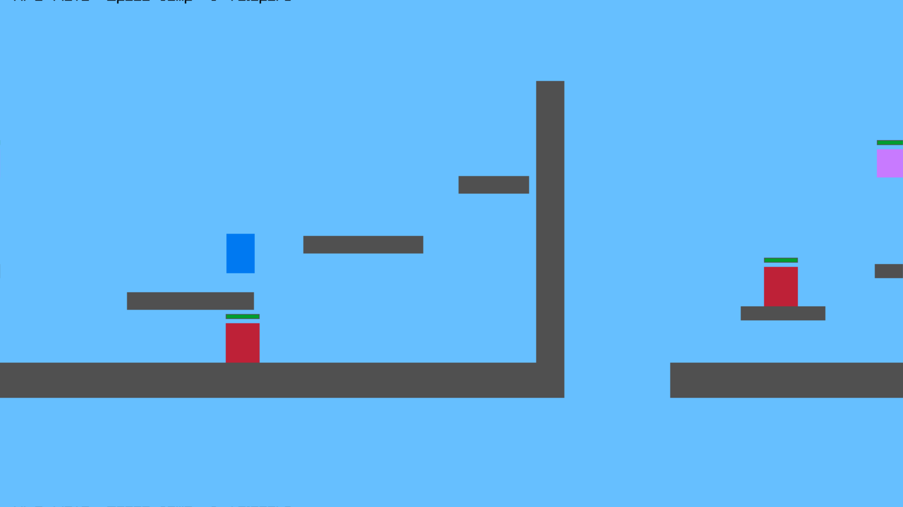

# Ziggy
A small Platformer written in Zig with Raylib.


*The early stages of the game*

## How to run

First clone the repository then compile

```bash
git clone https://github.com/almightyDavid/Ziggy.git
cd Ziggy
zig build run
```
